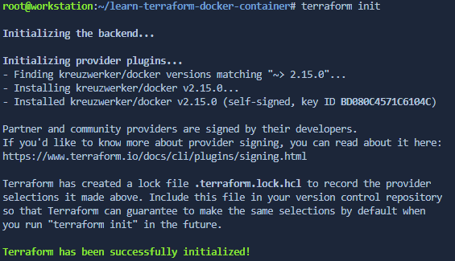
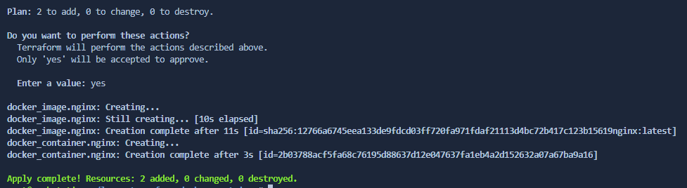

# Crear una infraestructura de Docker con terraform

## Codigo IaC

Veamos el código de este despliegue:

Se declaran los proveedores:
```terraform
terraform {
  required_providers {
    docker = {
      source  = "kreuzwerker/docker"
      version = "~> 2.16.0" 
    }
  }
}

provider "docker" {}
```

Luego, para Docker, la imagen y el contenedor:
```terraform
resource "docker_image" "nginx" {
  name         = "nginx:latest"
  keep_locally = false
}

resource "docker_container" "nginx" {
  image = docker_image.nginx.latest
  name  = "tutorial"
  ports {
    internal = 80
    external = 8000
  }
}
```

## Comandos para implementación

Inicializamos terraform:
```bash
terraform init
```



Revisamos la lista de cambios que se aplicarán:
```bash
terraform plan
```
El resultado es el siguiente:
```
Terraform used the selected providers to generate the following execution plan. Resource actions are indicated with the following symbols:
  + create

Terraform will perform the following actions:

  # docker_container.nginx will be created
  + resource "docker_container" "nginx" {
      + attach           = false
      + bridge           = (known after apply)
      + command          = (known after apply)
      + container_logs   = (known after apply)
      + entrypoint       = (known after apply)
      + env              = (known after apply)
      + exit_code        = (known after apply)
      + gateway          = (known after apply)
      + hostname         = (known after apply)
      + id               = (known after apply)
      + image            = (known after apply)
      + init             = (known after apply)
      + ip_address       = (known after apply)
      + ip_prefix_length = (known after apply)
      + ipc_mode         = (known after apply)
      + log_driver       = (known after apply)
      + logs             = false
      + must_run         = true
      + name             = "tutorial"
      + network_data     = (known after apply)
      + read_only        = false
      + remove_volumes   = true
      + restart          = "no"
      + rm               = false
      + security_opts    = (known after apply)
      + shm_size         = (known after apply)
      + start            = true
      + stdin_open       = false
      + tty              = false

      + healthcheck {
          + interval     = (known after apply)
          + retries      = (known after apply)
          + start_period = (known after apply)
          + test         = (known after apply)
          + timeout      = (known after apply)
        }

      + labels {
          + label = (known after apply)
          + value = (known after apply)
        }

      + ports {
          + external = 8000
          + internal = 80
          + ip       = "0.0.0.0"
          + protocol = "tcp"
        }
    }

  # docker_image.nginx will be created
  + resource "docker_image" "nginx" {
      + id           = (known after apply)
      + keep_locally = false
      + latest       = (known after apply)
      + name         = "nginx:latest"
      + output       = (known after apply)
      + repo_digest  = (known after apply)
    }

Plan: 2 to add, 0 to change, 0 to destroy.
```

Para aplicar los cambios introduciremos:
```bash
terraform apply
```

Veremos un mensaje similar al "plan" y se nos solicitará que confirmemos los cambios. Al hacerlo, pasados unos segundos tendremos la confirmación de los recursos añadidos/modificados/eliminados:



## Confirmación y limpieza

Para ver el nuevo contenedor que acabamos de crear con terraform:
```bash
docker ps
```

Para eliminar el despliegue y los recursos, lo "destruimos". Como en la aplicación, debemos confirmar escribiendo _yes_ en el prompt.
```
terraform destroy
```