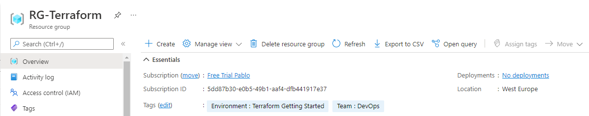
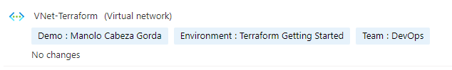

# Modificación del [RG anterior](../2-azure-resourcegroup/) y creación de una VNet

Añadimos el siguiente fragmento declarativo al archivo ya existente:

```Terraform
resource "azurerm_virtual_network" "vnet" {
  name                = "VNet-Terraform"
  address_space       = ["10.0.0.0/16"]
  location            = "westeurope"
  resource_group_name = azurerm_resource_group.rg.name
}
```

Si nos fijamos, estamos referenciando desde este fragmeno al RG creado anteriormente. Lo hacemos en `azurerm_resource_group.rg.name`.

Para aplicar los cambios:
```PowerShell
terraform apply
```

El resultado será similar al siguiente:
```
azurerm_resource_group.rg: Refreshing state... [id=/subscriptions/5dd87b30-e0b5-49b1-aaf4-dfb441917e37/resourceGroups/RG-Terraform]

Note: Objects have changed outside of Terraform

Terraform detected the following changes made outside of Terraform since the last "terraform apply":

  # azurerm_resource_group.rg has changed
  ~ resource "azurerm_resource_group" "rg" {
        id       = "/subscriptions/5dd87b30-e0b5-49b1-aaf4-dfb441917e37/resourceGroups/RG-Terraform"
        name     = "RG-Terraform"
      + tags     = {}
        # (1 unchanged attribute hidden)
    }


Unless you have made equivalent changes to your configuration, or ignored the relevant attributes using ignore_changes, the following plan may include actions to undo or respond to these changes.

───────────────────────────

Terraform used the selected providers to generate the following execution plan. Resource actions are indicated with the following symbols:
  + create

Terraform will perform the following actions:

  # azurerm_virtual_network.vnet will be created
  + resource "azurerm_virtual_network" "vnet" {
      + address_space       = [
          + "10.0.0.0/16",
        ]
      + dns_servers         = (known after apply)
      + guid                = (known after apply)
      + id                  = (known after apply)
      + location            = "westeurope"
      + name                = "VNet-Terraform"
      + resource_group_name = "RG-Terraform"
      + subnet              = (known after apply)
    }

Plan: 1 to add, 0 to change, 0 to destroy.

Do you want to perform these actions?
  Terraform will perform the actions described above.
  Only 'yes' will be accepted to approve.

  Enter a value: yes

azurerm_virtual_network.vnet: Creating...
azurerm_virtual_network.vnet: Creation complete after 3s [id=/subscriptions/5dd87b30-e0b5-49b1-aaf4-dfb441917e37/resourceGroups/RG-Terraform/providers/Microsoft.Network/virtualNetworks/VNet-Terraform]

Apply complete! Resources: 1 added, 0 changed, 0 destroyed.
```

## Modificaciones 

El resultado final se encuentra en el archivo [modification.tf](./modification.tf). 

Basta con añadir el siguiente fragmento al recurso del RG:
```Terraform
resource "azurerm_resource_group" "rg" {
  name     = "RG-Terraform"
  location = "westeurope"
  tags = {
    Environment = "Terraform Getting Started"
    Team = "DevOps"
  }
}
```

Aplicamos los cambios y los revisamos:
```PowerShell
terraform apply
terraform show
```

Si quisiéramos modificar también las etiquetas de la red, basta con modificar el recurso de forma similar a la siguiente:

```Terraform
resource "azurerm_virtual_network" "vnet" {
  name                = "VNet-Terraform"
  address_space       = ["10.0.0.0/16"]
  location            = "westeurope"
  resource_group_name = azurerm_resource_group.rg.name
  tags = {
    Environment = "Terraform Getting Started"
    Team = "DevOps"
    Demo = "Manolo Cabeza Gorda"
  }
}
```

Veamos el Grupo de Recursos:



Y también la Red Virtual:

